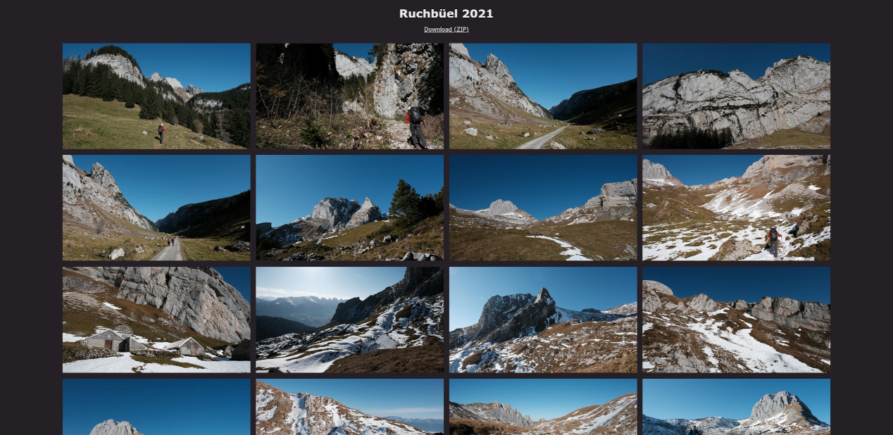

# Galerio

Galerio is a simple generator for HTML flexbox galleries written in Rust. From
a directory with JPEG files, it generates a self-contained gallery without
external dependencies.

## Features

- Simple CSS3/Flexbox based gallery
- Touch friendly lightbox for viewing images in full screen
- ZIP download of entire gallery (can be turned off)
- When resizing images, detect panorama photos and do not scale them

## Screenshot

## Installing

Through cargo:

    cargo install galerio

From Arch Linux AUR:

    yay -S galerio

## Building

    cargo build --release

Note: Make sure to create a release build, otherwise processing will be insanely slow.

## Usage

    galerio 1.0.1

    USAGE:
        galerio [FLAGS] [OPTIONS] <input-dir> <output-dir> <title>

    FLAGS:
            --help                       Prints help information
            --no-download                Disallow full gallery download as ZIP
        -p, --resize-include-panorama    Resize panoramas as well
            --skip-processing            Skip processing image files
        -V, --version                    Prints version information

    OPTIONS:
        -l, --max-large-size <max-large-size>    Max large image size in pixels
        -h, --height <thumbnail-height>          Max thumbnail height in pixels [default: 300]

    ARGS:
        <input-dir>     Input directory
        <output-dir>    Output directory
        <title>         Gallery title

Example:

    galerio /home/user/pictures/switzerland2020/ /srv/www/galleries/switzerland2020/ "Switzerland 2020"

## License

Licensed under either of

 * Apache License, Version 2.0 ([LICENSE-APACHE](LICENSE-APACHE) or
   http://www.apache.org/licenses/LICENSE-2.0)
 * MIT license ([LICENSE-MIT](LICENSE-MIT) or
   http://opensource.org/licenses/MIT) at your option.

### Contribution

Unless you explicitly state otherwise, any contribution intentionally submitted
for inclusion in the work by you, as defined in the Apache-2.0 license, shall
be dual licensed as above, without any additional terms or conditions.
